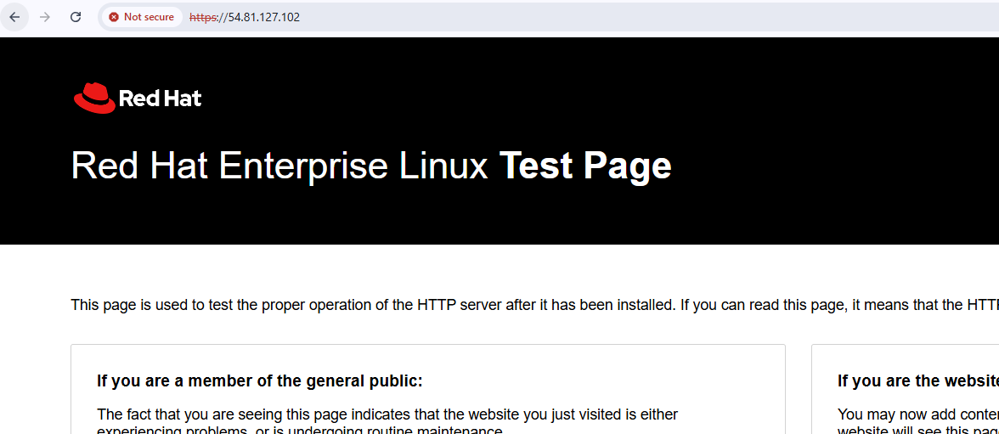
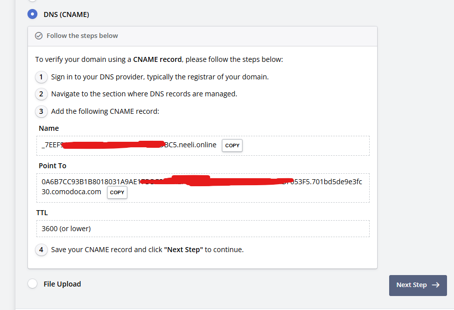
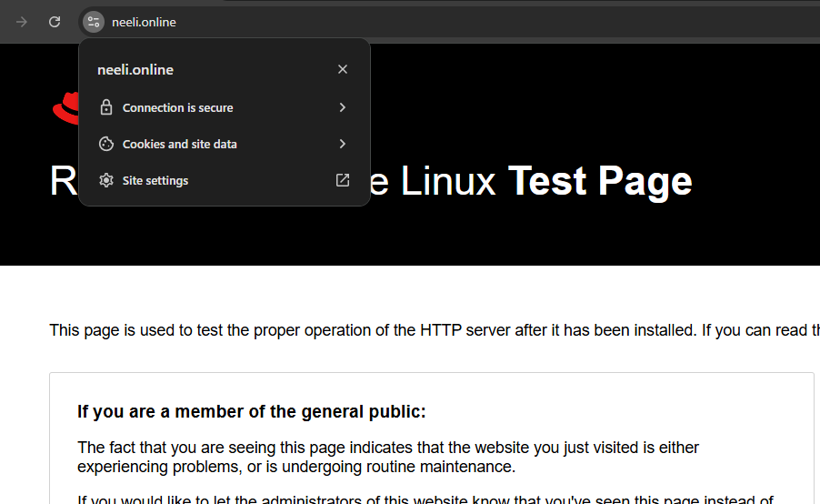

# HTTPS Certificate

## TLS Certificate
- Self Signed SSL Certificate
- CA Signed SSL Certificate
- AWS Certificate Manager

## Nginx AWS EC2 instance
- We can use Nginx as a web server to serve our application.
- We can install Nginx on AWS EC2 instance and configure it to serve our application.
- We can also configure Nginx to use SSL certificate for secure communication.
- Install Nginx on AWS EC2 instance, run below command.
```shell
#!/bin/bash
sudo dnf install nginx -y
sudo systemctl start nginx
sudo systemctl status nginx
```

## Self Signed SSL Certificate
- We can create self-signed SSL certificate using openssl command.
- This certificate is not trusted by browsers and will show warning message when accessed.
- This certificate is used for testing and development purposes.

- Generate private key
```shell
openssl genrsa -out private.pem 4096
```
- Generate public key from private key
```shell
openssl pkey -in private.pem -pubout -out public.pem
```
- Generate CSR (Certificate Signing Request). This CSR cert is public certificate which we will use to generate private key
```shell
openssl req -new -key private.pem -out csr.pem
```
- Generate self-signed certificate using CSR and private key
```shell
openssl x509 -req -in csr.pem -signkey private.pem -out certificate.crt -days 365 -sha256

example
[ ec2-user@ip-172-31-16-167 ~ ]$ openssl x509 -req -in csr.pem -signkey private.pem -out certificate.crt -days 365 -sha256
Certificate request self-signature ok
subject=C=AU, ST=VIC, L=CLYDE, O=Neeli, OU=IT, CN=neeli.online, emailAddress=mahesh.neeli@gmail.com
```
- Now we have certificate.crt file which is our self-signed SSL certificate.
- We can configure Nginx to use this certificate for secure communication.
- Copy private.pem and certificate.pem to /etc/nginx/ssl/ directory.
```shell
sudo mkdir -p /etc/nginx/ssl
sudo cp certificate.crt /etc/nginx/ssl/neeli.online.crt
sudo cp private.pem /etc/nginx/ssl/neeli.online.key

set permissions for private key
sudo chmod 644 /etc/nginx/ssl/neeli.online.crt
sudo chmod 600 /etc/nginx/ssl/neeli.online.key
```
- Now we need to configure Nginx to use this certificate.
- Open Nginx configuration file `sudo vim /etc/nginx/nginx.conf` and update the content from `nginx.conf` file.
```nginx
# HTTPS server
    server {
        listen       443 ssl http2;
        listen       [::]:443 ssl http2;
        server_name  neeli.online *.neeli.online;
        root         /usr/share/nginx/html;

        ssl_certificate        /etc/nginx/ssl/neeli.online.crt;
        ssl_certificate_key    /etc/nginx/ssl/neeli.online.key;
        ssl_session_cache      shared:SSL:1m;
        ssl_session_timeout    10m;
        ssl_protocols          TLSv1.2 TLSv1.3;
        ssl_ciphers            HIGH:!aNULL:!MD5;
        ssl_prefer_server_ciphers on;

        include /etc/nginx/default.d/*.conf;

        error_page 404 /404.html;
        location = /404.html {}

        error_page 500 502 503 504 /50x.html;
        location = /50x.html {}
    }
```
- Save and exit the file.
- Now we need to restart Nginx service to apply the changes.
- Ngnix will validate the certificate and terminate all https connections from that step onwards.
```shell
sudo systemctl restart nginx
```
- Now we can access our application using https://<public IP> and it will show warning message because it is a self-signed certificate.



## CA Signed SSL Certificate
- We can also use CA signed SSL certificate for secure communication.
- I am using zerossl(https://app.zerossl.com/certificate/new) website to create Certificate.
- We need to generate CSR (Certificate Signing Request) and private key as mentioned in self-signed SSL certificate section

- I have download the certificates after verifying the domain ownership.
- Now we need to copy the certificate and private key to /etc/nginx/ssl/ directory as similar to self-signed certificate section.
- Initially I am copying the certificate and private key to /tmp directory of EC2 instance using below command and then I will move it to /etc/nginx/ssl/ directory.
```shell
scp ca_bundle.crt ec2-user@54.81.127.102:/tmp
scp certificate.crt ec2-user@54.81.127.102:/tmp
scp private.key  ec2-user@54.81.127.102:/tmp

here scp = secure copy command
```
```shell
54.81.127.102 | 172.31.16.167 | t3.micro | null
[ ec2-user@ip-172-31-16-167 /tmp ]$ ls -l
total 12
-rw-r--r-- 1 ec2-user ec2-user 2431 Mar 16 11:17 ca_bundle.crt
-rw-r--r-- 1 ec2-user ec2-user 2264 Mar 16 11:20 certificate.crt
-rw-r--r-- 1 ec2-user ec2-user 1706 Mar 16 11:20 private.key
```
- Now bundle the certificate and CA bundle into a single file.
```shell
cat certificate.crt ca_bundle.crt > fullchain.crt
```
- Now we need to copy the fullchain.crt and private.key to /etc/nginx/ssl/ directory.
```shell
sudo mkdir -p /etc/nginx/ssl
sudo cp fullchain.crt /etc/nginx/ssl/neeli.online.crt
sudo cp private.key /etc/nginx/ssl/neeli.online.key
```
- Now reload the Nginx service to apply the changes.
```shell
sudo nginx -t
sudo systemctl reload nginx
```
- Now we can see that the certificate is valid and it is issued by a trusted CA.




## AWS Certificate Manager
- We can also use AWS Certificate Manager to create and manage SSL certificates for our application.
- We can request a public certificate from AWS Certificate Manager and use it with our Nginx server.
- We can also use AWS Certificate Manager to create a private certificate for our internal applications.